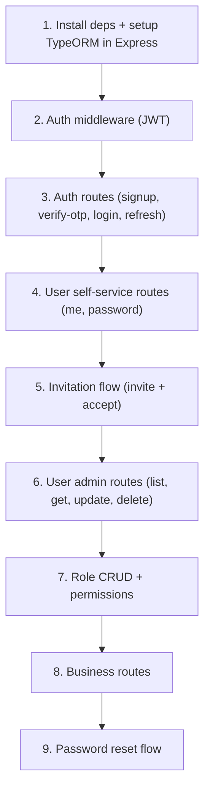

# User Module — Route Plan

## Current State

- **Framework:** Express 5 (CommonJS entry point `index.js`)
- **ORM:** TypeORM with 9 entities + enums (includes `invitations`)
- **Folders ready:** `routes/`, `controllers/`, `services/`, `middleware/` (all empty)
- **Missing:** bcrypt, JWT library, validation library

## Architecture Pattern

```
Request → Route → Middleware → Controller → Service → Entity/Repository
                                                          ↓
Response ← Controller ← Service ← Database (TypeORM)
```

| Layer | Responsibility |
|---|---|
| **Route** | HTTP verb + path mapping, attaches middleware |
| **Middleware** | Auth (JWT verification), validation, role-checking |
| **Controller** | Parses request, calls service, formats response |
| **Service** | Business logic, database operations via TypeORM |

---

## Routes Overview

### Auth (`/api/auth`)

| Method | Path | Auth? | Description |
|--------|------|-------|-------------|
| `POST` | `/api/auth/signup` | No | Register owner + create business |
| `POST` | `/api/auth/verify-otp` | No | Verify OTP (phone/email) |
| `POST` | `/api/auth/resend-otp` | No | Resend OTP code |
| `POST` | `/api/auth/login` | No | Login with email + password |
| `POST` | `/api/auth/refresh` | No | Refresh access token |
| `POST` | `/api/auth/forgot-password` | No | Send password reset OTP |
| `POST` | `/api/auth/reset-password` | No | Reset password with OTP |

### Users (`/api/users`) — Business-scoped

| Method | Path | Auth? | Role | Description |
|--------|------|-------|------|-------------|
| `POST` | `/api/users/invite` | Yes | OWNER/ADMIN | Send invitation to join business |
| `POST` | `/api/users/accept-invite` | No | — | Accept invitation + create account |
| `GET` | `/api/users` | Yes | Any | List all users in the business |
| `GET` | `/api/users/me` | Yes | Any | Get current user's profile |
| `PATCH` | `/api/users/me` | Yes | Any | Update own profile (name, email, phone) |
| `PATCH` | `/api/users/me/password` | Yes | Any | Change own password |
| `GET` | `/api/users/:id` | Yes | OWNER/ADMIN | Get a specific user |
| `PATCH` | `/api/users/:id` | Yes | OWNER/ADMIN | Update a user (name, roles) |
| `DELETE` | `/api/users/:id` | Yes | OWNER | Deactivate/remove a user |

### Invitations (`/api/invitations`) — Business-scoped

| Method | Path | Auth? | Role | Description |
|--------|------|-------|------|-------------|
| `GET` | `/api/invitations` | Yes | OWNER/ADMIN | List pending invitations |
| `DELETE` | `/api/invitations/:id` | Yes | OWNER/ADMIN | Cancel a pending invitation |

### Roles (`/api/roles`) — Business-scoped

| Method | Path | Auth? | Role | Description |
|--------|------|-------|------|-------------|
| `POST` | `/api/roles` | Yes | OWNER | Create a custom role for the business |
| `GET` | `/api/roles` | Yes | OWNER/ADMIN | List all roles in the business |
| `GET` | `/api/roles/:id` | Yes | OWNER/ADMIN | Get role details + permissions |
| `PATCH` | `/api/roles/:id` | Yes | OWNER | Update a role |
| `DELETE` | `/api/roles/:id` | Yes | OWNER | Delete a custom role (not system roles) |
| `PUT` | `/api/roles/:id/permissions` | Yes | OWNER | Set permissions for a role |

### Business (`/api/business`) — Owner-only management

| Method | Path | Auth? | Role | Description |
|--------|------|-------|------|-------------|
| `GET` | `/api/business` | Yes | Any | Get current business details |
| `PATCH` | `/api/business` | Yes | OWNER | Update business details |

---

## Route Details

### Auth Routes

#### `POST /api/auth/signup`

Atomic: creates user + business + seeds default roles + assigns OWNER role.

```
Request Body:
{
  "name": "Hammad",
  "email": "hammad@example.com",
  "phone": "+971501234567",
  "password": "securePass123",
  "business": {
    "name": "Acme Trading LLC",
    "vat_number": "100123456789003",
    "tl_number": "TL-12345",
    "industry_id": 1,
    "emirate": "DUBAI"
  }
}

Response 201:
{
  "message": "Account created. Please verify your phone number.",
  "user_id": 1,
  "business_id": 1
}
```

**Flow:**
1. Validate input
2. Check email/phone uniqueness
3. Hash password (bcrypt)
4. `BEGIN TRANSACTION`
5. Insert `business`
6. Insert `users` (with `business_id`, `created_by: NULL`)
7. Seed default roles (OWNER, ADMIN, ACCOUNTANT, VIEWER) for this business with `is_system: true`
8. Insert `user_roles` (assign OWNER)
9. Generate OTP → hash (bcrypt) → insert `otp_verifications`
10. `COMMIT`
11. Send OTP via SMS/email

#### `POST /api/auth/verify-otp`

```
Request Body:
{
  "user_id": 1,
  "code": "123456",
  "channel": "phone",
  "purpose": "signup"
}

Response 200:
{
  "message": "Phone verified successfully.",
  "access_token": "eyJhbG...",
  "refresh_token": "eyJhbG..."
}
```

**Flow:**
1. Find latest unexpired, unverified OTP for this user + channel + purpose
2. Hash submitted code (bcrypt), compare against stored `code_hash`
3. Increment `attempts` on failure (reject if `attempts >= max_attempts`)
4. On success: set `verified_at`, update `users.is_phone_verified`
5. Issue JWT tokens

#### `POST /api/auth/login`

```
Request Body:
{
  "email": "hammad@example.com",
  "password": "securePass123"
}

Response 200:
{
  "access_token": "eyJhbG...",
  "refresh_token": "eyJhbG...",
  "user": {
    "id": 1,
    "name": "Hammad",
    "email": "hammad@example.com",
    "business": {
      "id": 1,
      "name": "Acme Trading LLC"
    }
  }
}
```

**Flow:**
1. Find user by email (include business + roles)
2. Compare password with bcrypt
3. Check `is_phone_verified` (reject if not verified)
4. Issue JWT: `{ user_id, business_id, roles: ["OWNER"] }`

#### `POST /api/auth/refresh`

```
Request Body:
{
  "refresh_token": "eyJhbG..."
}

Response 200:
{
  "access_token": "new_eyJhbG...",
  "refresh_token": "new_eyJhbG..."
}
```

**Flow:**
1. Verify refresh token JWT, check `type === "refresh"`
2. Find user by `user_id` from payload (join business + roles)
3. If user not found (deleted) → 401
4. Sign new access + refresh tokens (token rotation)

#### `POST /api/auth/forgot-password`

```
Request Body:
{
  "email": "hammad@example.com"
}

Response 200:
{
  "message": "If an account exists, a reset code has been sent."
}
```

**Flow:**
1. Find user by email (don't reveal if not found — always return 200)
2. Generate OTP with `purpose: reset_password`
3. Send via email

#### `POST /api/auth/reset-password`

```
Request Body:
{
  "email": "hammad@example.com",
  "code": "123456",
  "new_password": "newSecurePass456"
}

Response 200:
{
  "message": "Password reset successfully."
}
```

**Flow:**
1. Find user by email
2. Find valid OTP with `purpose: reset_password`
3. Verify OTP (same logic as verify-otp)
4. Hash new password (bcrypt), update user record
5. Mark OTP as verified

---

### User Management Routes

All routes are **business-scoped**: the service always filters by `business_id` from the JWT.

#### `POST /api/users/invite` — Invite user to business

Sends an invitation email. Does NOT create a user record — the email is not reserved until the invitee accepts.

```
Request Body:
{
  "email": "ahmed@example.com",
  "role_id": 2
}

Response 201:
{
  "message": "Invitation sent to ahmed@example.com",
  "invitation_id": 1,
  "expires_at": "2026-07-12T01:00:00Z"
}
```

**Flow:**
1. Auth middleware: verify JWT, extract `business_id`
2. Role middleware: require OWNER or ADMIN
3. Validate input
4. Verify `role_id` belongs to this business
5. Check: user with this email already in this business? → 409
6. Check: pending invitation for this email + business? → 409
7. Generate secure token (`crypto.randomBytes(32)`)
8. Hash token (bcrypt), insert `invitations` record (expires in 7 days)
9. Send invitation email with link: `/accept-invite?token=<raw_token>`

#### `POST /api/users/accept-invite` — Accept invitation

Public route — the invited person calls this. Creates the user account.

```
Request Body:
{
  "token": "abc123def456...",
  "name": "Ahmed",
  "phone": "+971509876543",
  "password": "securePass123"
}

Response 201:
{
  "message": "Account created successfully.",
  "access_token": "eyJhbG...",
  "refresh_token": "eyJhbG...",
  "user": {
    "id": 2,
    "name": "Ahmed",
    "email": "ahmed@example.com",
    "roles": ["ADMIN"],
    "business": {
      "id": 1,
      "name": "Acme Trading LLC"
    }
  }
}
```

**Flow:**
1. Hash submitted token (bcrypt)
2. Find invitation by `token_hash` WHERE `accepted_at IS NULL` AND `expires_at > NOW()`
3. If not found → 400 "Invalid or expired invitation"
4. Check phone uniqueness → 409 if taken
5. Hash password (bcrypt)
6. `BEGIN TRANSACTION`
7. Insert `users` (business_id from invite, created_by from `invited_by`, `is_email_verified: true`)
8. Insert `user_roles` (role_id from invitation)
9. Update invitation: `SET accepted_at = NOW()`
10. `COMMIT`
11. Sign JWT, return tokens + user

> **Why `is_email_verified: true`?** The invitee proved they own the email by receiving the invitation link and clicking it. No separate OTP needed.

#### `GET /api/users` — List business users

```
Response 200:
{
  "users": [
    {
      "id": 1,
      "name": "Hammad",
      "email": "hammad@example.com",
      "roles": ["OWNER"],
      "is_phone_verified": true,
      "created_at": "2026-07-02T..."
    },
    ...
  ],
  "total": 2,
  "page": 1,
  "limit": 20
}
```

#### `GET /api/users/me` — Own profile

Returns the authenticated user's full profile with roles and business info.

#### `PATCH /api/users/me` — Update own profile

```
Request Body (all optional):
{
  "name": "Hammad Updated",
  "email": "new@example.com",
  "phone": "+971501111111"
}
```

> [!NOTE]
> Changing email/phone triggers OTP re-verification and sets `is_email_verified` / `is_phone_verified` to `false`.

#### `PATCH /api/users/me/password` — Change own password

```
Request Body:
{
  "current_password": "oldPass123",
  "new_password": "newSecurePass456"
}
```

#### `PATCH /api/users/:id` — Update a user (admin)

Only name and role reassignment. Cannot change another user's email, phone, or password — those are self-service only.

```
Request Body (all optional):
{
  "name": "Ahmed Updated",
  "role_ids": [2, 3]
}
```

#### `DELETE /api/users/:id` — Remove user

Only OWNER can remove users. Cannot remove yourself. Cannot remove another OWNER. Cascades to `user_roles`.

---

### Invitation Management Routes

#### `GET /api/invitations` — List pending invitations

```
Response 200:
{
  "invitations": [
    {
      "id": 1,
      "email": "sara@example.com",
      "role": "ACCOUNTANT",
      "invited_by": "Hammad",
      "expires_at": "2026-07-12T01:00:00Z",
      "created_at": "2026-07-05T01:00:00Z"
    }
  ]
}
```

#### `DELETE /api/invitations/:id` — Cancel invitation

Deletes the invitation record. The email becomes available for re-invitation.

---

### Role Management Routes

#### `POST /api/roles` — Create custom role

```
Request Body:
{
  "name": "SENIOR_ACCOUNTANT",
  "description": "Can approve and submit invoices"
}

Response 201:
{
  "id": 5,
  "name": "SENIOR_ACCOUNTANT",
  "description": "Can approve and submit invoices",
  "business_id": 1,
  "is_system": false
}
```

Custom roles are created with `is_system: false`. System roles (OWNER, ADMIN, ACCOUNTANT, VIEWER) have `is_system: true` and cannot be modified or deleted.

#### `PUT /api/roles/:id/permissions` — Set role permissions

Replaces all existing permissions for this role (delete + insert in transaction).

```
Request Body:
{
  "permissions": [
    { "feature_id": 1, "permission": "ALL" },
    { "feature_id": 2, "permission": "READ" }
  ]
}

Response 200:
{
  "role_id": 5,
  "permissions": [
    { "feature": "invoices", "permission": "ALL" },
    { "feature": "reports", "permission": "READ" }
  ]
}
```

#### `DELETE /api/roles/:id` — Delete custom role

Rejects if `is_system: true` (403). Rejects if users are still assigned to it (400).

---

## Middleware Stack

| Middleware | Purpose |
|---|---|
| `authenticate` | Verifies JWT, attaches `req.user = { user_id, business_id, roles }` |
| `authorize(...roles)` | Checks `req.user.roles` against allowed roles |
| `validate(schema)` | Validates `req.body` against a zod schema |

---

## Required Dependencies

| Package | Purpose |
|---|---|
| `bcrypt` | Password hashing |
| `jsonwebtoken` | JWT signing/verification |
| `zod` | Request body validation |

---

## File Structure (After Implementation)

```
src/
├── middleware/
│   ├── authenticate.ts
│   ├── authorize.ts
│   └── validate.ts
├── routes/
│   ├── auth.routes.ts
│   ├── user.routes.ts
│   ├── invitation.routes.ts
│   ├── role.routes.ts
│   └── business.routes.ts
├── controllers/
│   ├── auth.controller.ts
│   ├── user.controller.ts
│   ├── invitation.controller.ts
│   ├── role.controller.ts
│   └── business.controller.ts
├── services/
│   ├── auth.service.ts
│   ├── user.service.ts
│   ├── invitation.service.ts
│   ├── role.service.ts
│   └── otp.service.ts
├── entities/
│   ├── index.ts
│   ├── enums.ts
│   ├── Business.ts
│   ├── Feature.ts
│   ├── Industry.ts
│   ├── Invitation.ts
│   ├── OtpVerification.ts
│   ├── Role.ts
│   ├── RolePermission.ts
│   ├── User.ts
│   └── UserRole.ts
├── migrations/
│   └── (generated migrations)
└── data-source.ts
```

## Implementation Order



1. **Install deps**, connect TypeORM to Express, create `Invitation` entity + migration
2. **Auth middleware** — JWT verify + role check (everything downstream depends on this)
3. **Auth routes** — signup, OTP, login, refresh (this is how users get into the system)
4. **User self-service** — `/me` profile, password change
5. **Invitation flow** — invite + accept-invite (how new users join a business)
6. **User admin routes** — list, get, update, delete (OWNER/ADMIN manages team)
7. **Role management** — CRUD for business-scoped roles + permission assignment
8. **Business routes** — view/update business details
9. **Password reset** — forgot password + reset with OTP

## Route Summary (27 total)

| Group | Method | Path | Auth | Role |
|-------|--------|------|------|------|
| Auth | `POST` | `/api/auth/signup` | — | — |
| Auth | `POST` | `/api/auth/verify-otp` | — | — |
| Auth | `POST` | `/api/auth/resend-otp` | — | — |
| Auth | `POST` | `/api/auth/login` | — | — |
| Auth | `POST` | `/api/auth/refresh` | — | — |
| Auth | `POST` | `/api/auth/forgot-password` | — | — |
| Auth | `POST` | `/api/auth/reset-password` | — | — |
| Users | `POST` | `/api/users/invite` | 🔒 | OWNER, ADMIN |
| Users | `POST` | `/api/users/accept-invite` | — | — |
| Users | `GET` | `/api/users` | 🔒 | Any |
| Users | `GET` | `/api/users/me` | 🔒 | Any |
| Users | `PATCH` | `/api/users/me` | 🔒 | Any |
| Users | `PATCH` | `/api/users/me/password` | 🔒 | Any |
| Users | `GET` | `/api/users/:id` | 🔒 | OWNER, ADMIN |
| Users | `PATCH` | `/api/users/:id` | 🔒 | OWNER, ADMIN |
| Users | `DELETE` | `/api/users/:id` | 🔒 | OWNER |
| Invitations | `GET` | `/api/invitations` | 🔒 | OWNER, ADMIN |
| Invitations | `DELETE` | `/api/invitations/:id` | 🔒 | OWNER, ADMIN |
| Roles | `POST` | `/api/roles` | 🔒 | OWNER |
| Roles | `GET` | `/api/roles` | 🔒 | OWNER, ADMIN |
| Roles | `GET` | `/api/roles/:id` | 🔒 | OWNER, ADMIN |
| Roles | `PATCH` | `/api/roles/:id` | 🔒 | OWNER |
| Roles | `DELETE` | `/api/roles/:id` | 🔒 | OWNER |
| Roles | `PUT` | `/api/roles/:id/permissions` | 🔒 | OWNER |
| Business | `GET` | `/api/business` | 🔒 | Any |
| Business | `PATCH` | `/api/business` | 🔒 | OWNER |
